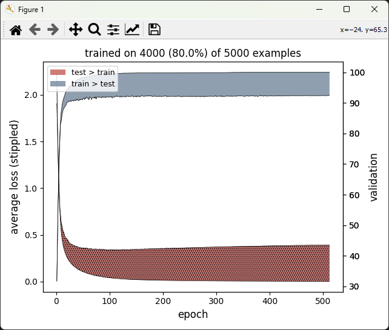
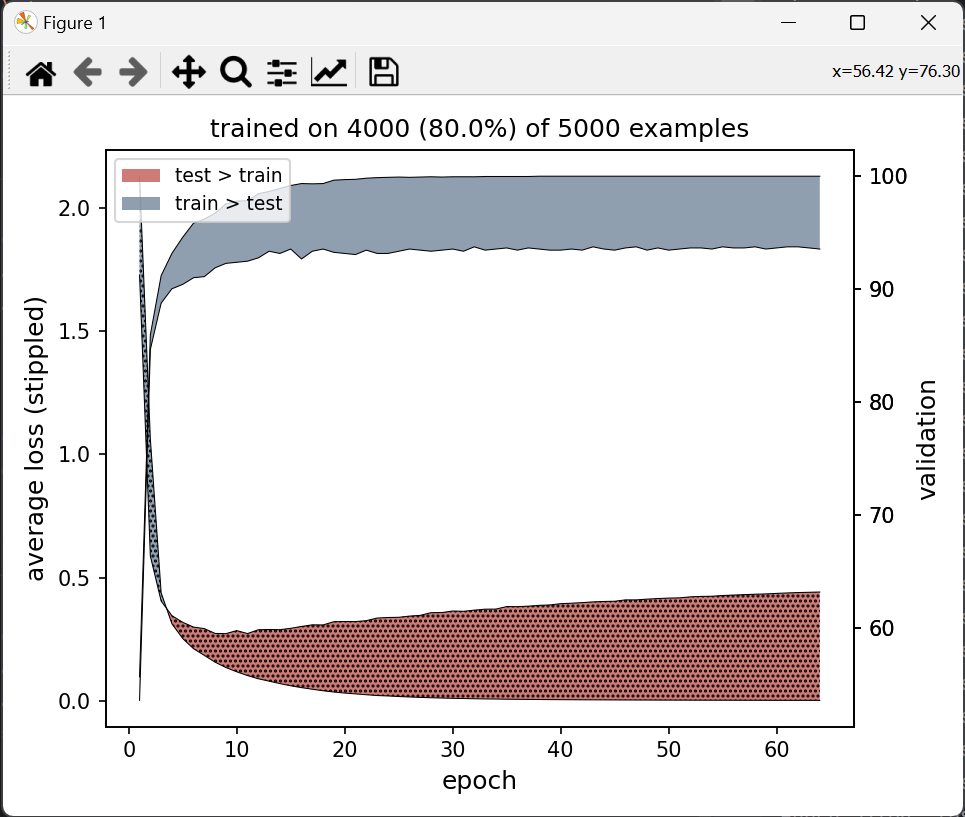

<a id="top"></a>

# Assignment 10

```python
import torch
import torch.nn as nn
from skimage import io
import du.lib as dulib
import math

train_amount = 0.8
learning_rate = 0.00001
momentum = 0.9
epochs = 512
batch_size = 16
centered = False
normalized = False
hidden_layer_widths = [200]

digits = io.imread('digits.png')
xss = torch.Tensor(5000, 400)
idx = 0
for i in range(0, 1000, 20):
    for j in range(0, 2000, 20):
        xss[idx] = torch.Tensor((digits[i:i + 20, j:j + 20]).flatten())
        idx = idx + 1

yss = torch.LongTensor(len(xss))
for i in range(len(yss)):
    yss[i] = i // 500

random_split = torch.randperm(xss.size(0))
train_split_amount = (math.floor(xss.size(0) * train_amount))

xss_train_means = 0
xss_train_stds = 1

xss_train = xss[random_split][:train_split_amount]

if centered:
    xss_train, xss_train_means = dulib.center(xss_train)
if normalized:
    xss_train, xss_train_stds = dulib.normalize(xss_train)

xss_test = (xss[random_split][train_split_amount:] - xss_train_means) / xss_train_stds

yss_train = yss[random_split][:train_split_amount]
yss_test = yss[random_split][train_split_amount:]


class LogSoftmaxModel(nn.Module):
    def __init__(self):
        super(LogSoftmaxModel, self).__init__()
        widths = hidden_layer_widths.copy()
        widths.insert(0, 400)
        widths.append(10)

        self.in_layer = nn.Linear(400, widths[0])

        hidden_layers = []

        for j in range(len(widths) - 1):
            hidden_layers.append(nn.Linear(widths[j], widths[j + 1]))

        self.hidden_layers = nn.ModuleList(hidden_layers)
        self.out_layer = nn.Linear(widths[-1], 10)

    def forward(self, x):
        x = self.in_layer(x)
        for layer in self.hidden_layers:
            x = torch.relu(layer(x))
        x = self.out_layer(x)
        return torch.log_softmax(x, dim=1)


model = LogSoftmaxModel()
criterion = nn.NLLLoss()


def pct_correct(xss_test_, yss_test_):
    count = 0

    for x, y in zip(xss_test_, yss_test_):
        if torch.argmax(x).item() == y.item():
            count += 1

    return 100 * count / len(xss_test_)


model = dulib.train(
    model,
    crit=criterion,
    train_data=(xss_train, yss_train),
    valid_data=(xss_test, yss_test),
    learn_params={'lr': learning_rate, 'mo': momentum},
    epochs=epochs,
    bs=batch_size,
    valid_metric=pct_correct,
    graph=1,
    print_lines=(-1,)
)

print('\nTraining Data Confusion Matrix\n')
pct_training = dulib.class_accuracy(model, (xss_train, yss_train), show_cm=True)

print('\nTesting Data Confusion Matrix\n')
pct_testing = dulib.class_accuracy(model, (xss_test, yss_test), show_cm=True)

weights = 401 * hidden_layer_widths[0]

for i in range(len(hidden_layer_widths) - 1):
    weights += (hidden_layer_widths[i] + 1) * hidden_layer_widths[i + 1]

weights += (hidden_layer_widths[len(hidden_layer_widths) - 1] + 1) * 10

print(
    f'\n'
    f'Percentage correct on training data: {100 * pct_training:.2f}\n'
    f'Percentage correct on testing data: {100 * pct_testing:.2f}\n'
    f'\n'
    f'Train Amount: {100 * train_amount}%\n'
    f'Learning Rate: {learning_rate}\n'
    f'Momentum: {momentum}\n'
    f'Epochs: {epochs}\n'
    f'Batch Size: {batch_size}\n'
    f'Hidden Layer Widths: {hidden_layer_widths}\n'
    f'Weights: {weights}'
)
```

## Output

Centering and normalizing the train and test data correctly made training the model to perform well on test data much
more difficult. As such, they are disabled for now. The computed number of weights for one hidden layer of width 200
is 82210.

```
trained in 12 min 52.0 sec

Training Data Confusion Matrix

                          Actual
         0    1    2    3    4    5    6    7    8    9 (correct)
     --------------------------------------------------
  0 | 10.4    0    0    0    0    0    0    0    0    0 (100.0% of 415)
  1 |    0  9.8    0    0    0    0    0    0    0    0 (100.0% of 392)
  2 |    0    0  9.9    0    0    0    0    0    0    0 (100.0% of 398)
  3 |    0    0    0  9.9    0    0    0    0    0    0 (100.0% of 396)
  4 |    0    0    0    0 10.2    0    0    0    0    0 (100.0% of 408)
  5 |    0    0    0    0    0  9.8    0    0    0    0 (100.0% of 392)
  6 |    0    0    0    0    0    0 10.1    0    0    0 (100.0% of 402)
  7 |    0    0    0    0    0    0    0 10.0    0    0 (100.0% of 400)
  8 |    0    0    0    0    0    0    0    0  9.9    0 (100.0% of 395)
  9 |    0    0    0    0    0    0    0    0    0 10.1 (100.0% of 402)

Testing Data Confusion Matrix

                          Actual
         0    1    2    3    4    5    6    7    8    9 (correct)
     --------------------------------------------------
  0 |  8.3    0    0    0    0    0    0    0    0    0 (97.6% of 85)
  1 |    0 10.5   .1   .1    0    0    0   .1    0    0 (97.2% of 108)
  2 |    0    0  8.8   .2   .3    0    0   .1   .1    0 (86.3% of 102)
  3 |    0   .2   .2  9.2   .1   .3    0    0   .2   .2 (88.5% of 104)
  4 |    0    0   .1    0  7.7    0    0   .4    0   .2 (83.7% of 92)
  5 |    0    0    0   .5   .2 10.3   .2    0   .4    0 (95.4% of 108)
  6 |    0    0   .2    0   .3   .1  9.6    0   .1    0 (98.0% of 98)
  7 |    0   .1   .1   .2    0   .1    0  9.3    0    0 (93.0% of 100)
  8 |   .2    0   .7   .2   .1    0    0   .1  9.6   .3 (91.4% of 105)
  9 |    0    0    0    0   .5    0    0    0   .1  9.1 (92.9% of 98)

Percentage correct on training data: 100.00
Percentage correct on testing data: 92.40

Learning Rate: 1e-05
Momentum: 0.9
Epochs: 512
Batch Size: 16
Hidden Layer Widths: [200]
Weights: 82210
```



The `test.py` file continuously trains different models with randomized parameters, adds them to output.txt in csv
format, and prints the current model's parameters and performance on test data and the best model's parameters. This
will need to be changed to implement correct centering and normalizing with the train and test splits and reran.
Ironically, a neural net could then be used to determine the best parameters for this neural net.

## Update

The following code correctly implements centered and normalized data.

```python
import torch
import torch.nn as nn
from skimage import io
import du.lib as dulib
import math

train_amount = 0.8
learning_rate = 0.01
momentum = 0.75
epochs = 64
batch_size = 32
centered = True
normalized = True
hidden_layer_widths = [200]

digits = io.imread('digits.png')
xss = torch.Tensor(5000, 400)
idx = 0
for i in range(0, 1000, 20):
    for j in range(0, 2000, 20):
        xss[idx] = torch.Tensor((digits[i:i + 20, j:j + 20]).flatten())
        idx = idx + 1

yss = torch.LongTensor(len(xss))
for i in range(len(yss)):
    yss[i] = i // 500

random_split = torch.randperm(xss.size(0))
train_split_amount = math.floor(xss.size(0) * train_amount)

xss_train = xss[random_split][:train_split_amount]
xss_test = xss[random_split][train_split_amount:]

if centered:
    xss_train, xss_train_means = dulib.center(xss_train)
    xss_test, _ = dulib.center(xss_test, xss_train_means)
if normalized:
    xss_train, xss_train_stds = dulib.normalize(xss_train)
    xss_test, _ = dulib.normalize(xss_test, xss_train_stds)

yss_train = yss[random_split][:train_split_amount]
yss_test = yss[random_split][train_split_amount:]


class LogSoftmaxModel(nn.Module):
    def __init__(self):
        super(LogSoftmaxModel, self).__init__()
        widths = hidden_layer_widths.copy()
        widths.insert(0, 400)
        widths.append(10)

        self.in_layer = nn.Linear(400, widths[0])

        hidden_layers = []

        for j in range(len(widths) - 1):
            hidden_layers.append(nn.Linear(widths[j], widths[j + 1]))

        self.hidden_layers = nn.ModuleList(hidden_layers)
        self.out_layer = nn.Linear(widths[-1], 10)

    def forward(self, x):
        x = self.in_layer(x)
        for layer in self.hidden_layers:
            x = torch.relu(layer(x))
        x = self.out_layer(x)
        return torch.log_softmax(x, dim=1)


model = LogSoftmaxModel()
criterion = nn.NLLLoss()


def pct_correct(xss_test_, yss_test_):
    count = 0

    for x, y in zip(xss_test_, yss_test_):
        if torch.argmax(x).item() == y.item():
            count += 1

    return 100 * count / len(xss_test_)


model = dulib.train(
    model,
    crit=criterion,
    train_data=(xss_train, yss_train),
    valid_data=(xss_test, yss_test),
    learn_params={'lr': learning_rate, 'mo': momentum},
    epochs=epochs,
    bs=batch_size,
    valid_metric=pct_correct,
    graph=1,
    print_lines=(-1,)
)

print('\nTraining Data Confusion Matrix\n')
pct_training = dulib.class_accuracy(model, (xss_train, yss_train), show_cm=True)

print('\nTesting Data Confusion Matrix\n')
pct_testing = dulib.class_accuracy(model, (xss_test, yss_test), show_cm=True)

weights = 401 * hidden_layer_widths[0]

for i in range(len(hidden_layer_widths) - 1):
    weights += (hidden_layer_widths[i] + 1) * hidden_layer_widths[i + 1]

weights += (hidden_layer_widths[len(hidden_layer_widths) - 1] + 1) * 10

print(
    f'\n'
    f'Percentage correct on training data: {100 * pct_training:.2f}\n'
    f'Percentage correct on testing data: {100 * pct_testing:.2f}\n'
    f'\n'
    f'Train Amount: {100 * train_amount}%\n'
    f'Learning Rate: {learning_rate}\n'
    f'Momentum: {momentum}\n'
    f'Epochs: {epochs}\n'
    f'Batch Size: {batch_size}\n'
    f'Hidden Layer Widths: {hidden_layer_widths}\n'
    f'Weights: {weights}'
)
```

## Output

The model now performs similarly with centering and normalizing enabled.

```
trained in 1 min 12.7 sec

Training Data Confusion Matrix

                          Actual
         0    1    2    3    4    5    6    7    8    9 (correct)
     --------------------------------------------------
  0 |  9.8    0    0    0    0    0    0    0    0    0 (100.0% of 392)
  1 |    0  9.9    0    0    0    0    0    0    0    0 (100.0% of 397)
  2 |    0    0  9.9    0    0    0    0    0    0    0 (100.0% of 396)
  3 |    0    0    0  9.7    0    0    0    0    0    0 (100.0% of 389)
  4 |    0    0    0    0 10.3    0    0    0    0    0 (100.0% of 412)
  5 |    0    0    0    0    0  9.9    0    0    0    0 (100.0% of 398)
  6 |    0    0    0    0    0    0 10.0    0    0    0 (100.0% of 400)
  7 |    0    0    0    0    0    0    0 10.2    0    0 (100.0% of 410)
  8 |    0    0    0    0    0    0    0    0 10.1    0 (100.0% of 405)
  9 |    0    0    0    0    0    0    0    0    0 10.0 (100.0% of 401)

Testing Data Confusion Matrix

                          Actual
         0    1    2    3    4    5    6    7    8    9 (correct)
     --------------------------------------------------
  0 | 10.6    0    0    0    0   .1   .1    0    0    0 (98.1% of 108)
  1 |    0  9.8   .1    0    0    0    0    0    0    0 (95.1% of 103)
  2 |    0   .2  9.6   .2   .2    0   .2   .1   .2   .1 (92.3% of 104)
  3 |    0    0   .1 10.5    0   .2    0   .1   .1   .2 (94.6% of 111)
  4 |    0    0   .1    0  8.0    0    0    0   .2   .2 (90.9% of 88)
  5 |   .1   .2    0   .2    0  9.8    0    0   .2    0 (96.1% of 102)
  6 |    0    0   .2    0    0   .1  9.5    0   .2    0 (95.0% of 100)
  7 |    0    0   .1   .1    0    0    0  8.5    0   .6 (94.4% of 90)
  8 |   .1   .1   .2   .1   .1    0   .2    0  8.4   .1 (88.4% of 95)
  9 |    0    0    0    0   .5    0    0   .3   .2  8.7 (87.9% of 99)

Percentage correct on training data: 100.00
Percentage correct on testing data: 93.40

Train Amount: 80.0%
Learning Rate: 0.01
Momentum: 0.75
Epochs: 64
Batch Size: 32
Hidden Layer Widths: [200]
Weights: 82210
```



## Other Parameters

The following parameters train to 100% accuracy on train data and 95.9% on test data:

```
Train amount: 80.0%
Learning rate: 0.021069506786110068
Momentum: 0.0981809441628804
Batch size: 38
Centered: 0
Normalized: 0
Hidden layer count: 8
Hidden layer widths: [244, 287, 145, 73, 297, 125, 166, 27]
```

These parameters were found using random search with the `test.py` file, updated to correctly implement centering
and normalizing.
