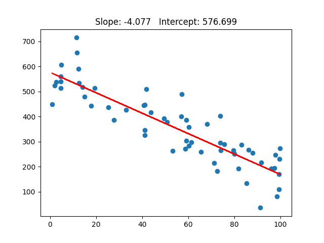

<a id="top"></a>

# Assignment 2

[github.com/braydenoneal/csci-362/tree/master/assignments/2](https://github.com/braydenoneal/csci-362/tree/master/assignments/2#top)

## Source

```python
import torch
import csv
import matplotlib.pyplot as plt

with open('assign2.csv') as data_file:
    reader = csv.reader(data_file, delimiter=',')
    next(data_file)
    x_values = []
    y_values = []
    for line in reader:
        x_values.append(float(line[0]))
        y_values.append(float(line[1]))

x_values = torch.tensor(x_values)
y_values = torch.tensor(y_values)

design_matrix = torch.ones(x_values.size(0), 2)
design_matrix[:,1] = x_values

least_squares = (
    design_matrix.transpose(0, 1)
    .mm(design_matrix).inverse()
    .mm(design_matrix.transpose(0, 1))
    .mm(y_values.unsqueeze(1))
)

intercept = least_squares[0].item()
slope = least_squares[1].item()

plt.title(f"Slope: {slope:.4}   Intercept: {intercept:.6}")

plt.scatter(x_values, y_values)
plt.plot(x_values, x_values * slope + intercept, color="red")
plt.show()
```

## Output


