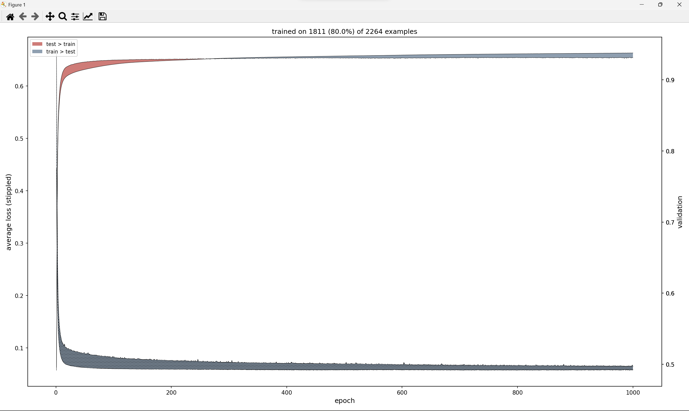

# Assignment 8: Graphing with DULib

```python
# ols.py                                                     SSimmons March 2018
#                                                    Brayden O'Neal November 2023
"""
Uses a neural net to find the ordinary least-squares regression model. Trains
with batch gradient descent, and computes r^2 to gauge predictive quality.
Implements momentum.
"""
import math
import torch
import pandas as pd
import torch.nn as nn
import du.lib as dulib

# Read the named columns from the csv file into a dataframe.
names = ['SalePrice', '1st_Flr_SF', '2nd_Flr_SF', 'Lot_Area', 'Overall_Qual',
         'Overall_Cond', 'Year_Built', 'Year_Remod/Add', 'BsmtFin_SF_1', 'Total_Bsmt_SF',
         'Gr_Liv_Area', 'TotRms_AbvGrd', 'Bsmt_Unf_SF', 'Full_Bath']
df = pd.read_csv('AmesHousing.csv', names=names)
data = df.values  # read data into a numpy array (as a list of lists)
data = data[1:]  # remove the first list which consists of the labels
data = data.astype(float)  # coerce the entries in the numpy array to floats
data = torch.FloatTensor(data)  # convert data to a Torch tensor

data.sub_(data.mean(0))  # mean-center
data.div_(data.std(0))  # normalize

xss = data[:, 1:]
yss = data[:, :1]

train_amount = 0.8

random_split = torch.randperm(xss.size(0))

xss_train = xss[random_split][:(math.floor(xss.size(0) * train_amount))]
xss_test = xss[random_split][(math.floor(xss.size(0) * train_amount)):]

yss_train = yss[random_split][:(math.floor(yss.size(0) * train_amount))]
yss_test = yss[random_split][(math.floor(yss.size(0) * train_amount)):]

# define a model class
class NonLinearModel(nn.Module):
    def __init__(self):
        super(NonLinearModel, self).__init__()
        self.layer1 = nn.Linear(13, 10)
        self.layer2 = nn.Linear(10, 1)

    def forward(self, values):
        values = self.layer1(values)
        values = torch.relu(values)
        return self.layer2(values)


# create and print an instance of the model class
model = NonLinearModel()
criterion = nn.MSELoss()

num_examples = len(data)
batch_size = 30
learning_rate = 0.000355
momentum = 0.3
epochs = 1000

# train the model
model = dulib.train(
    model,
    crit=criterion,
    train_data=(xss_train, yss_train),
    valid_data=(xss_test, yss_test),
    learn_params={'lr': learning_rate, 'mo': momentum},
    epochs=epochs,
    bs=batch_size,
    graph=1
)

print("train explained variation:", dulib.explained_var(model, (xss_train, yss_train)))
print("test explained variation:", dulib.explained_var(model, (xss_test, yss_test)))
```

## Output

The graph shows that we can stop training at around 250 epochs.


