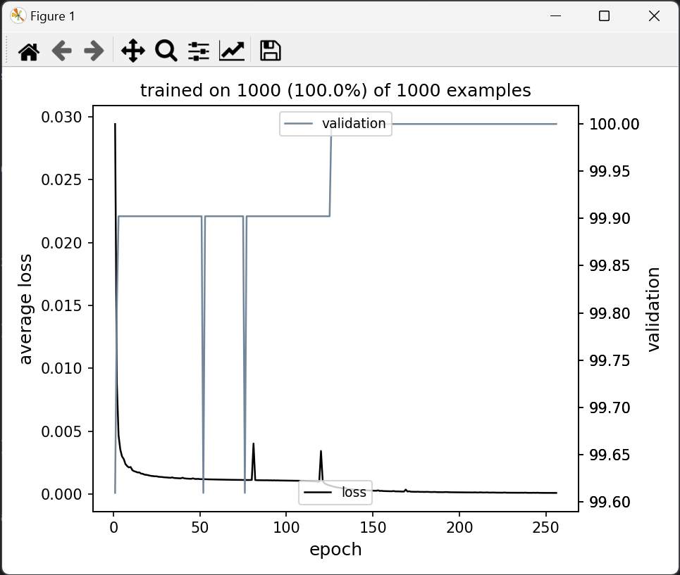
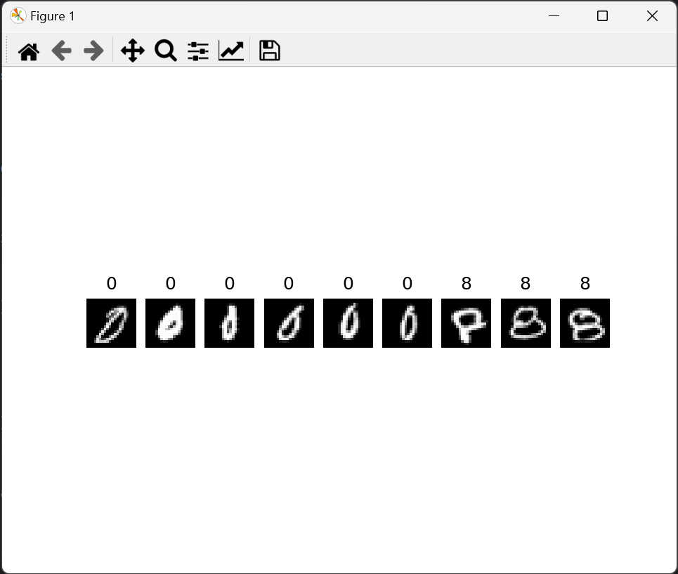
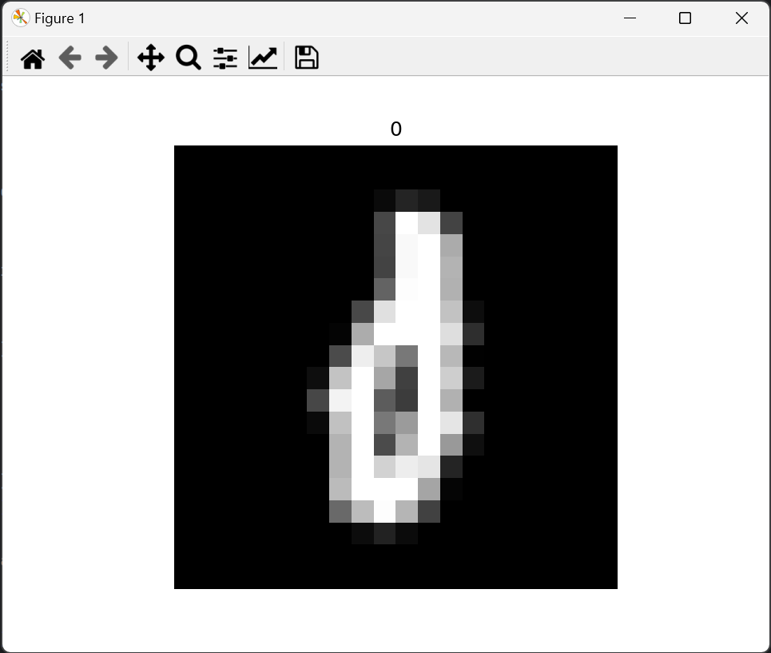

# Assignment 9: Handwritten Digits Dataset

```python
import torch
import torch.cuda
import torch.nn as nn
from skimage import io
import du.lib as dulib
from matplotlib import pyplot as plt

digits = io.imread('digits.png')
xss = torch.Tensor(5000, 400).cuda()
idx = 0
for i in range(0, 1000, 20):
    for j in range(0, 2000, 20):
        xss[idx] = torch.Tensor((digits[i:i + 20, j:j + 20]).flatten()).cuda()
        idx = idx + 1

tempxss = torch.Tensor(1000, 400).cuda()
tempxss[:500] = xss[:500]
tempxss[500:] = xss[4000:4500]

xss = tempxss

yss = torch.Tensor(len(xss), 1).cuda()
for i in range(len(yss)):
    yss[i] = i // 500

xss, xss_means = dulib.center(xss)
xss, xss_stds = dulib.normalize(xss)


class LinearModel(nn.Module):
    def __init__(self):
        super(LinearModel, self).__init__()
        self.layer1 = nn.Linear(400, 1)

    def forward(self, x):
        x = self.layer1(x)
        return torch.sigmoid(x)


model = LinearModel().cuda()
criterion = nn.MSELoss()


def pct_correct(yhatss, yss_):
    zero = torch.min(yss_).item()
    eight = torch.max(yss_).item()
    th = 1e-3
    cutoff = (zero + eight) / 2
    count = 0

    for yhats, ys in zip(yhatss, yss_):
        yhat = yhats.item()
        y = ys.item()
        if (yhat > cutoff and abs(y - eight) < th) or (yhat < cutoff and abs(y - zero) < th):
            count += 1

    return 100 * count / len(yss_)


learning_rate = 0.1
momentum = 0.7
epochs = 256
batch_size = 32

model = dulib.train(
    model,
    crit=criterion,
    train_data=(xss, yss),
    learn_params={'lr': learning_rate, 'mo': momentum},
    epochs=epochs,
    bs=batch_size,
    valid_metric=pct_correct,
)

zero = torch.min(yss).item()
eight = torch.max(yss).item()
th = 1e-3
cutoff = (zero + eight) / 2

misread_images = []

count = 0
for i in range(len(xss)):
    yhat = model(xss[i]).item()
    y = yss[i].item()
    if (yhat > cutoff and abs(y - eight) < th) or (yhat < cutoff and abs(y - zero) < th):
        count += 1
    else:
        image = (xss[i] * xss_stds + xss_means).reshape(20, 20).detach().cpu().numpy()
        misread_images.append((8 if y > cutoff else 0, image))

print(
    f'\n'
    f'Percentage correct: {100 * count / len(xss)}\n'
    f'\n'
    f'Learning Rate: {learning_rate}\n'
    f'Momentum: {momentum}\n'
    f'Epochs: {epochs}\n'
    f'Batch Size: {batch_size}'
)

if len(misread_images) > 0:
    figure, subplots = plt.subplots(1, len(misread_images), squeeze=False)

    for i in range(len(misread_images)):
        subplots[0][i].imshow(misread_images[i][1], cmap='gray')
        subplots[0][i].title.set_text(misread_images[i][0])
        subplots[0][i].set_axis_off()

    plt.show()
```

## Output

With the following learning parameters, the model consitenly trains to 100% accuracy.

```
training on cuda:0 (data is on cpu:0)
epoch 1/256; loss 0.0261975
epoch 2/256; loss 0.00672614
epoch 3/256; loss 0.00446721
epoch 4/256; loss 0.00386075
epoch 5/256; loss 0.00309785
epoch 6/256; loss 0.00264464
epoch 7/256; loss 0.00243729
...
epoch 249/256; loss 0.000161498
epoch 250/256; loss 0.000161601
epoch 251/256; loss 0.000163041
epoch 252/256; loss 0.000167467
epoch 253/256; loss 0.000154791
epoch 254/256; loss 0.000158977
epoch 255/256; loss 0.000153163
epoch 256/256; loss 0.000150189
trained in 7.5 sec

Percentage correct: 100.0

Learning Rate: 0.1
Momentum: 0.7
Epochs: 256
Batch Size: 32
```



The code can also display the incorrectly identified images.



For around half or more of the epochs, the model incorrectly identifies only one image, which is the following:


