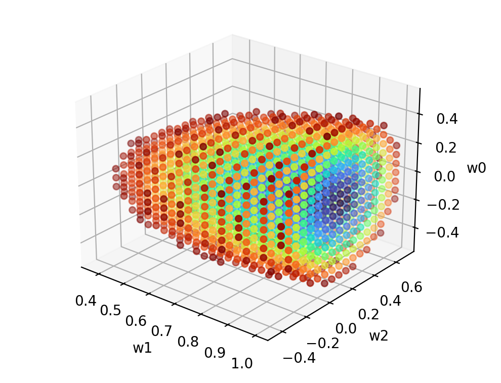

# Loss Graphing in 3D

For a linear regression problem, gradient descent can be used to test how accurate different lines are at representing
the data. Each line is represented as weights for each input of the data and the loss measures the accuracy.

A three-dimensional visual representation of the loss at different weights can be created if the data has three input 
variables.

Each weight is plotted on a different axis and the loss is mapped to a color spectrum. The points are plotted on a grid
and the scaling and origin can be adjusted for better results.

The points are displayed only when they are below a certain loss cutoff to make the shape easier to see.

The [main.py](main.py) file plots the weights and loss of the [temp_co2_data.csv](temp_co2_data.csv) dataset:

The center of the shape represents the optimal weights.

This is technically a grid search solution to a linear regression problem since the weights are plotted at evenly-spaced
intervals within a set of boundaries. This is not an optimal solution, but it is useful for visualization.
